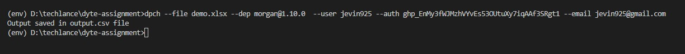
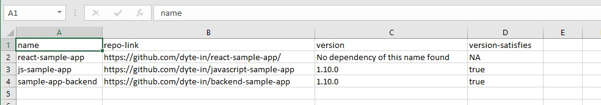

[](https://classroom.github.com/online_ide?assignment_repo_id=7954913&assignment_repo_type=AssignmentRepo)
<div id="top"></div>
<!--
*** Thanks for checking out the Best-README-Template. If you have a suggestion
*** that would make this better, please fork the repo and create a pull request
*** or simply open an issue with the tag "enhancement".
*** Don't forget to give the project a star!
*** Thanks again! Now go create something AMAZING! :D
-->


<!-- PROJECT SHIELDS -->
<!--
*** I'm using markdown "reference style" links for readability.
*** Reference links are enclosed in brackets [ ] instead of parentheses ( ).
*** See the bottom of this document for the declaration of the reference variables
*** for contributors-url, forks-url, etc. This is an optional, concise syntax you may use.
*** https://www.markdownguide.org/basic-syntax/#reference-style-links
-->

[![LinkedIn][linkedin-shield]][linkedin-url]


<!-- PROJECT LOGO -->
<br />
<div align="center">
  <a href="https://github.com/dyte-submissions/dyte-vit-2022-jevin925">
    
  </a>

<h3 align="center">Automating dependency check with github</h3>

</div>


## Built With

* [Python](https://www.python.org/)
* [Github api](https://docs.github.com/en/rest)
* [Pypi](https://pypi.org/project/dependency-checker-dpch/)

<p align="right">(<a href="#top">back to top</a>)</p>

## About the project

Dependency checker made with python and it is also converted in a package for easy installation in linux and macOS environment.

<!-- GETTING STARTED -->
# Getting Started

### Features
1. Made python package for easy installation of packages in linux.
2. CLI tool implemented.
3. Response saved in csv file.


### Prerequisites
1. Python
2. pip
3. virtual environment

### Running with python package(converted python file into a package)

1. Open command prompt install package
   ```sh
   Install package command: pip install dependency-checker-dpch
   To install pip in linux: sudo apt install python3-pip
   ```
2. Open cmd and write command for executing the file
   ```sh
   dpch --file <csv file name> --dep <dependency to check> --user <github username> --auth <github auth toke> --email <email of your github account> --u <no parameters just wirte it if you need to update the version and create PR>
   ```
   ```sh
   example command: dpch --file D:\jevin\dyte-assignment\demo.xlsx --dep morgan@1.10.0  --user jevin925 --auth ghp_EnMy*************3qAAf3SRgt1 --email jevin925@gmail.com --u
   ```
   ```sh
   Note: If you are giving only file name in input make sure the file is present in your current directory.
   ```
3. Output will be save in file output.csv at your current woking directory.

### Running the file manually

1. Clone the repo and cd into dependency checker folder
   ```sh
   git clone https://github.com/dyte-submissions/dyte-vit-2022-jevin925.git
   ```
   
2. Make virtual environment and activate it
   ```sh
   virtual environment command: py -m venv <env name>
   activating command: <env name>\Scripts\activate.bat
   ```
3. Install all dependencies from requirements.txt
   ```sh
   install command: pip install -r requirements.txt
   ```
4. Run command in terminal
   ```sh
   python <name of file> --file <csv file name> --dep <dependency to check> --user <github username> --auth <github auth toke> --email <email of your github account> --u <no parameters just wirte it if you need to update the version and create PR>
    ```
   ```sh
   example command:  python dep_chk.py --file D:\jevin\dyte-assignment\demo.xlsx --dep morgan@1.10.0  --user jevin925 --auth ghp_EnMy*************3qAAf3SRgt1 --email jevin925@gmail.com --u
   ```
   ```sh
   Note: If you are giving only file name in input make sure the file is present in your current directory.
   ```
3. Output will be save in file output.csv at your current woking directory.


<p align="right">(<a href="#top">back to top</a>)</p>

# Output
### Executing in command line by python package :


### Output file :


# Contact

Jevin Vekaria - jevn925@gmail.com

Project Link: [https://github.com/dyte-submissions/dyte-vit-2022-jevin925](https://github.com/dyte-submissions/dyte-vit-2022-jevin925)

<p align="right">(<a href="#top">back to top</a>)</p>


<!-- <p align="right">(<a href="#top">back to top</a>)</p> -->

<!-- MARKDOWN LINKS & IMAGES -->
<!-- https://www.markdownguide.org/basic-syntax/#reference-style-links -->
[contributors-shield]: https://img.shields.io/github/contributors/github_username/repo_name.svg?style=for-the-badge
[contributors-url]: https://github.com/github_username/repo_name/graphs/contributors
[forks-shield]: https://img.shields.io/github/forks/github_username/repo_name.svg?style=for-the-badge
[forks-url]: https://github.com/github_username/repo_name/network/members
[stars-shield]: https://img.shields.io/github/stars/github_username/repo_name.svg?style=for-the-badge
[stars-url]: https://github.com/github_username/repo_name/stargazers
[issues-shield]: https://img.shields.io/github/issues/github_username/repo_name.svg?style=for-the-badge
[issues-url]: https://github.com/github_username/repo_name/issues
[license-shield]: https://img.shields.io/github/license/github_username/repo_name.svg?style=for-the-badge
[license-url]: https://github.com/github_username/repo_name/blob/master/LICENSE.txt
[linkedin-shield]: https://img.shields.io/badge/-LinkedIn-black.svg?style=for-the-badge&logo=linkedin&colorB=555
[linkedin-url]: https://www.linkedin.com/in/jevin-vekaria-04a7361a3/
[product-screenshot]: images/screenshot.png
